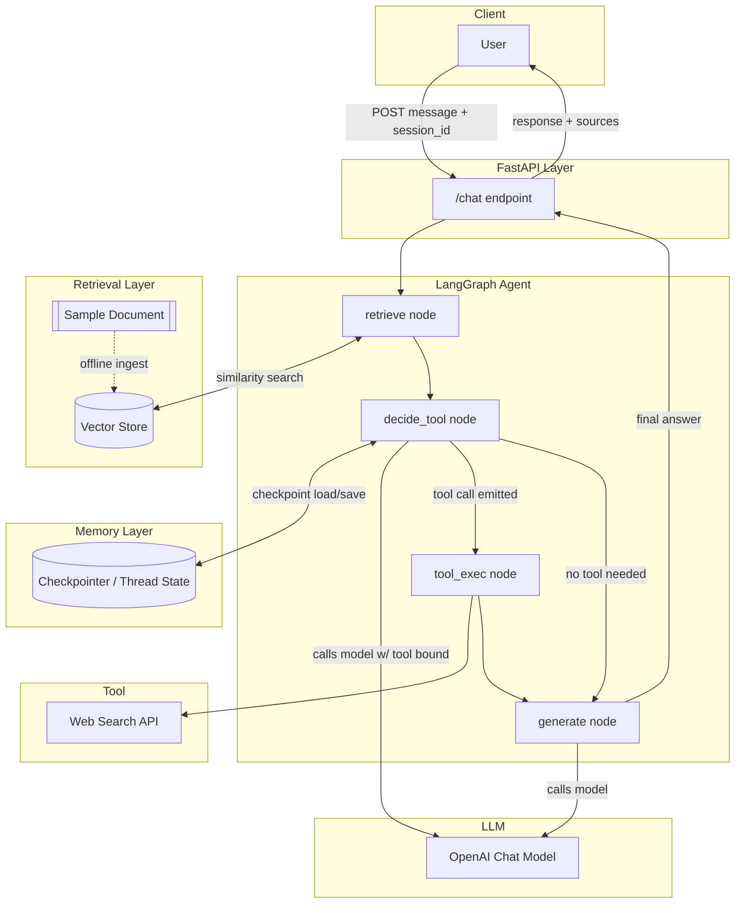
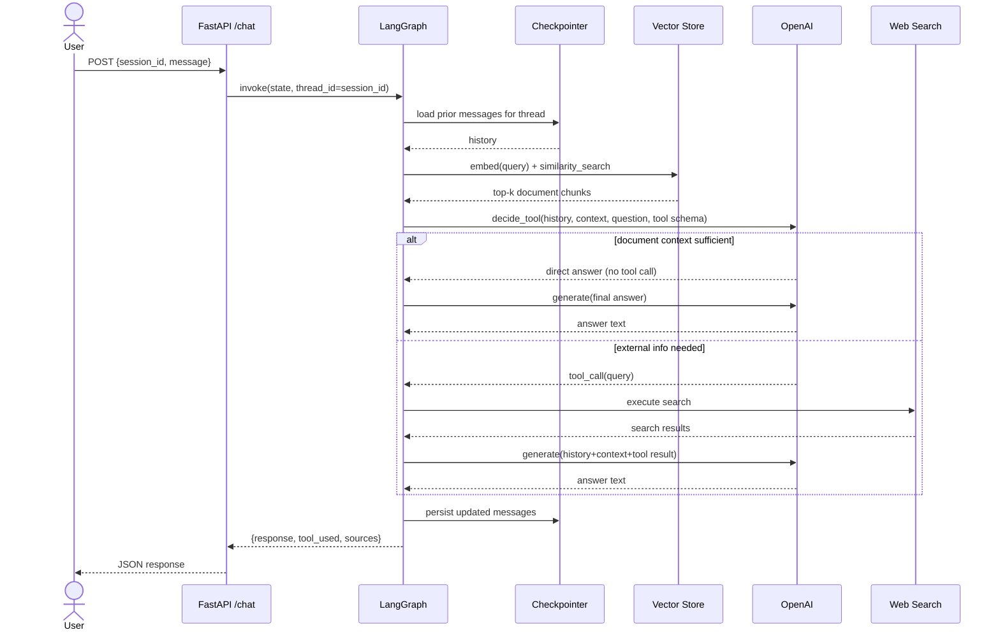

# Document Q&A Agent — Phase 1: Architecture Design

**Stack:** LangGraph · OpenAI API · FastAPI · Conversation Memory · Document Retrieval · One Tool (Web Search)

> This document is design-only. No implementation code is included, per instructions.

---

## 1. Project Folder Structure

```
doc-qa-agent/
├── app/
│   ├── __init__.py
│   ├── main.py                     # FastAPI app entrypoint
│   ├── config.py                   # Settings, env vars, constants
│   │
│   ├── api/
│   │   ├── __init__.py
│   │   ├── routes.py                # /chat, /health, /session endpoints
│   │   └── schemas.py               # Pydantic request/response models
│   │
│   ├── graph/
│   │   ├── __init__.py
│   │   ├── state.py                 # AgentState TypedDict/Pydantic definition
│   │   ├── builder.py               # StateGraph construction & compilation
│   │   ├── nodes/
│   │   │   ├── __init__.py
│   │   │   ├── retrieve.py          # Document retrieval node
│   │   │   ├── decide_tool.py       # Router / tool-decision node
│   │   │   ├── generate.py          # Final answer generation node
│   │   │   └── tool_exec.py         # Tool execution node (ToolNode wrapper)
│   │   └── edges.py                 # Conditional edge functions
│   │
│   ├── tools/
│   │   ├── __init__.py
│   │   └── web_search_tool.py       # Single tool definition (e.g. web search)
│   │
│   ├── retrieval/
│   │   ├── __init__.py
│   │   ├── loader.py                # Loads & chunks the one sample document
│   │   ├── embeddings.py            # Embedding model wrapper (OpenAI embeddings)
│   │   ├── vector_store.py          # Vector DB client (Chroma/FAISS) init + query
│   │   └── ingest.py                # One-time ingestion/indexing script (offline)
│   │
│   ├── memory/
│   │   ├── __init__.py
│   │   ├── checkpointer.py          # LangGraph checkpointer (memory persistence)
│   │   └── session_store.py         # Session/thread ID management
│   │
│   └── llm/
│       ├── __init__.py
│       └── client.py                # OpenAI chat model client factory
│
├── data/
│   └── sample_document.pdf          # The one source document (or .txt/.md)
│
├── vector_db/                       # Persisted vector index (generated at ingest time)
│
├── tests/
│   ├── __init__.py
│   ├── test_graph.py
│   ├── test_retrieval.py
│   ├── test_tool_decision.py
│   └── test_api.py
│
├── scripts/
│   └── run_ingest.py                # CLI entry to (re)build the vector index
│
├── .env.example                     # OPENAI_API_KEY, SEARCH_API_KEY, etc.
├── requirements.txt
├── pyproject.toml                   # (optional) packaging/tooling config
├── README.md
└── PHASE_1_ARCHITECTURE.md          # this document
```

---

## 2. High-Level Architecture

Four cooperating subsystems, deliberately decoupled so each can be tested, swapped, or scaled independently:

1. **API Layer (FastAPI)** — stateless HTTP boundary. Receives a user message + session/thread id, invokes the compiled LangGraph graph, returns the answer.
2. **Orchestration Layer (LangGraph)** — the agent's brain. A `StateGraph` that routes between retrieval, tool use, and generation based on the evolving `AgentState`.
3. **Knowledge Layer (Retrieval)** — a vector store built once (offline ingestion) from the single sample document; queried per turn for relevant chunks.
4. **Memory Layer** — LangGraph's checkpointer persists full conversation state per `thread_id`, giving multi-turn context without re-sending history manually.

Design principle: **the LLM never decides infrastructure concerns** (which vector store, which embedding model) — it only decides *behavioral* concerns (does this turn need the tool?). Infrastructure is deterministic code; judgment is the model's job.

---

## 3. LangGraph Workflow

Nodes:

- **`retrieve`** — always runs first. Embeds the user's latest message, queries the vector store for top-k chunks from the sample document, attaches them to state as `retrieved_context`.
- **`decide_tool`** — an LLM call (with the tool bound) that looks at the user question + retrieved context + conversation history and either (a) emits a tool call, or (b) emits a direct response signal. This is the router — implemented as a conditional edge reading the LLM's output (presence of `tool_calls`).
- **`tool_exec`** — a `ToolNode` that executes the tool call (e.g., web search) and appends the `ToolMessage` result to state.
- **`generate`** — synthesizes the final answer from: conversation history + retrieved document context + (optional) tool results. This is the only node that produces the user-facing message.

Edges:

- `START → retrieve` (unconditional)
- `retrieve → decide_tool` (unconditional)
- `decide_tool → tool_exec` **if** the LLM emitted a tool call
- `decide_tool → generate` **if** no tool call was emitted (document context was sufficient)
- `tool_exec → generate` (unconditional — after tool runs, always synthesize)
- `generate → END`

This gives a **single possible tool round-trip per turn** (no runaway tool-calling loops), which is intentional for a Phase-1 scope — predictable, debuggable, cost-bounded.

---

## 4. State Design

The `AgentState` is the single object threaded through every node. Conceptually (fields, not code):

| Field | Type | Purpose |
|---|---|---|
| `messages` | list of chat messages (append-only, reducer-managed) | Full conversation history — user, assistant, tool messages. This is what LangGraph's memory checkpointer persists. |
| `retrieved_context` | list of strings/chunks | Document chunks retrieved this turn. Scoped per-turn, not accumulated. |
| `tool_call_requested` | bool / derived | Whether the router decided a tool is needed this turn. Used by the conditional edge. |
| `tool_result` | string / structured | Output of the tool, if invoked. |
| `session_id` / `thread_id` | string | Identifies which persisted conversation this belongs to. |

Design rationale:
- `messages` uses LangGraph's built-in `add_messages` reducer so nodes only need to *return new messages*, not manage the full list — avoids race conditions and duplication bugs.
- `retrieved_context` and `tool_result` are **per-turn, not cumulative** — stale retrieved chunks from turn 1 must not leak into turn 5's generation, or the agent will answer off old context.
- Keeping state minimal and flat (no deep nesting) makes the graph easy to debug via LangGraph Studio/tracing and easy to checkpoint/serialize.

---

## 5. Conversation Memory Design

- Use LangGraph's **checkpointer** (`MemorySaver` for local/dev, swappable for `SqliteSaver`/`PostgresSaver` in production) keyed by `thread_id`.
- Every API request carries a `session_id` from the client; this maps 1:1 to a LangGraph `thread_id`.
- Memory is **short-term (within-thread) only** in Phase 1 — the checkpointer persists the message list across turns of the *same* conversation. No cross-session long-term memory/user-profile store is in scope for Phase 1 (that would be a Phase 2+ concern, e.g. a separate summarization/vector-memory layer).
- On each request, the graph is invoked with `config={"configurable": {"thread_id": session_id}}` — LangGraph automatically loads prior state for that thread before running the new turn.
- To bound token growth, a **trimming/summarization strategy** is noted as a future hook (e.g., trim to last N messages, or summarize older turns) — flagged in design but not built in Phase 1 unless required.

Why a checkpointer over manual DB reads/writes: it's the framework-native mechanism, gives free replay/debugging (time-travel), and keeps memory management out of node logic — nodes stay pure functions of state in, state-delta out.

---

## 6. Document Retrieval Flow

**Offline (one-time, via `scripts/run_ingest.py`):**
1. Load the single sample document (`data/sample_document.pdf`).
2. Split into overlapping chunks (size/overlap tuned to document type).
3. Embed each chunk with an OpenAI embedding model.
4. Persist vectors + metadata into a local vector store (Chroma/FAISS) under `vector_db/`.

**Online (per user turn, inside the `retrieve` node):**
1. Take the latest user message (optionally rewritten using recent conversation context for better standalone-query quality).
2. Embed the query.
3. Similarity-search top-k chunks from the persisted vector store.
4. Attach chunk text (+ optional source metadata) to `retrieved_context` in state.

Why separate ingestion from serving: the document is fixed/singular for this challenge, so re-embedding it on every request would be wasteful and slow. Ingestion is a build-time step; retrieval is a cheap read-time step. This mirrors production RAG systems where indexing and querying are decoupled pipelines.

---

## 7. Tool Decision Flow (When to Use the Tool vs. Not)

The tool (e.g., **web search**) exists for questions the sample document **cannot** answer — e.g., anything requiring current/external information not present in the source text.

**Decision is made by the LLM itself**, not by brittle keyword rules, using this pattern:
1. The `decide_tool` node calls the OpenAI model with the tool **bound** (function-calling schema attached) and a system prompt instructing: *"Use the retrieved document context to answer if it's sufficient. Only call the tool if the answer clearly requires information outside the provided document (e.g., current events, real-time data, or facts not present in the context)."*
2. The model sees: user question + `retrieved_context` from the `retrieve` node + conversation history.
3. If `retrieved_context` sufficiently answers the question → model responds directly, **no tool call emitted** → conditional edge routes to `generate`.
4. If the question is out-of-document-scope (or explicitly asks for something like "search the web for...", "what's the latest...", or a calculation, depending on tool chosen) → model emits a tool call → conditional edge routes to `tool_exec`.

**Concrete triggers to call the tool:**
- Question references information temporally or topically outside the document (e.g., "what's the current price of X" when document is static).
- Retrieved chunks have low similarity score / are empty (retrieval came back weak — signal passed into the prompt as "context may be insufficient").
- User explicitly asks for external lookup or computation (if calculator).

**Concrete triggers to NOT call the tool:**
- Retrieved context directly contains the answer.
- Question is conversational/meta ("can you summarize what we discussed?") — answerable from `messages` history alone.
- Question is a follow-up clarification about already-retrieved content.

This keeps the routing logic **model-driven but constrained** — the system prompt + visible context act as guardrails so the LLM doesn't over-call the tool, and the single-hop graph structure (Section 3) prevents infinite tool loops even if it tries.

---

## 8. FastAPI Endpoint Design

| Method | Path | Purpose |
|---|---|---|
| `POST` | `/chat` | Main endpoint. Body: `{ session_id: str, message: str }`. Invokes the compiled graph with that thread_id, returns `{ response: str, tool_used: bool, sources: [...] }`. |
| `GET` | `/session/{session_id}/history` | Returns the persisted message history for a thread (debug/UI convenience). |
| `POST` | `/session` | Creates a new session/thread id (optional — client may also generate its own UUID). |
| `GET` | `/health` | Liveness/readiness check (verifies vector store loaded, OpenAI key present). |

Design notes:
- `session_id` is the only piece of client-managed state — everything else lives server-side in the checkpointer, keeping the API stateless-per-request and horizontally scalable.
- Response includes `tool_used` and `sources` (retrieved chunk references) for **transparency/observability** — important for evaluating whether the tool-decision logic is behaving correctly during grading/demo.
- Schemas (`app/api/schemas.py`) validate input/output shape independently of the graph's internal state shape — API contract stays stable even if internal `AgentState` evolves.

---

## 9. Mermaid Architecture Diagram



---

## 10. Mermaid Sequence Diagram



---

## 11. Complete File List

| File | Description |
|---|---|
| `app/__init__.py` | Marks `app` as a package. |
| `app/main.py` | Creates the FastAPI app, mounts routers, loads config on startup, initializes the compiled graph and vector store as app state. |
| `app/config.py` | Centralized settings (env vars: `OPENAI_API_KEY`, model names, vector DB path, chunk size, top-k, tool API keys) via Pydantic `BaseSettings`. |
| `app/api/routes.py` | Defines `/chat`, `/session`, `/health` route handlers; translates HTTP requests into graph invocations. |
| `app/api/schemas.py` | Pydantic request/response models (`ChatRequest`, `ChatResponse`, etc.) decoupled from internal graph state. |
| `app/graph/state.py` | Defines the `AgentState` schema (messages, retrieved_context, tool_call_requested, tool_result, thread/session id). |
| `app/graph/builder.py` | Constructs the `StateGraph`: registers nodes, adds edges/conditional edges, compiles with the checkpointer. |
| `app/graph/nodes/retrieve.py` | Implements the retrieval node: embed query → vector search → populate `retrieved_context`. |
| `app/graph/nodes/decide_tool.py` | Implements the router node: calls OpenAI with tool bound, system prompt instructing conditional tool use, returns message with/without tool_calls. |
| `app/graph/nodes/tool_exec.py` | Wraps the single tool as a LangGraph `ToolNode` (or custom executor) and appends `ToolMessage` to state. |
| `app/graph/nodes/generate.py` | Final-answer synthesis node: combines history + retrieved_context + tool_result into the user-facing response. |
| `app/graph/edges.py` | Conditional edge function(s) — inspects latest AI message for tool_calls to route `decide_tool → tool_exec` or `decide_tool → generate`. |
| `app/tools/web_search_tool.py` | Defines the single external tool (e.g., a `@tool`-decorated web search function) with a clear docstring the LLM uses to decide relevance. |
| `app/retrieval/loader.py` | Loads the sample document from disk and splits it into chunks (recursive character/text splitter). |
| `app/retrieval/embeddings.py` | Wraps the OpenAI embeddings client used both at ingest time and query time (ensures consistency). |
| `app/retrieval/vector_store.py` | Initializes/loads the persisted vector store (Chroma/FAISS) and exposes a `similarity_search` function. |
| `app/retrieval/ingest.py` | Orchestrates the offline pipeline: load → chunk → embed → persist to `vector_db/`. |
| `app/memory/checkpointer.py` | Instantiates the LangGraph checkpointer (`MemorySaver` for dev; pluggable for `SqliteSaver`/`PostgresSaver`). |
| `app/memory/session_store.py` | Helper for generating/validating `session_id`s and mapping them to LangGraph `thread_id`s. |
| `app/llm/client.py` | Factory for the OpenAI chat model client (model name, temperature, etc., sourced from config) used by both `decide_tool` and `generate`. |
| `data/sample_document.pdf` | The single source document the agent answers questions about. |
| `vector_db/` | Generated directory holding the persisted vector index (not hand-written; output of ingestion). |
| `scripts/run_ingest.py` | CLI script to (re)build the vector index from the sample document — run once before serving. |
| `tests/test_graph.py` | Tests graph compilation, node wiring, and conditional routing logic. |
| `tests/test_retrieval.py` | Tests chunking, embedding, and similarity search correctness. |
| `tests/test_tool_decision.py` | Tests that the router correctly calls/doesn't call the tool for a set of scripted in-document vs. out-of-document questions. |
| `tests/test_api.py` | Integration tests for `/chat`, `/session`, `/health` endpoints. |
| `.env.example` | Template listing required environment variables without real secrets. |
| `requirements.txt` | Pinned dependencies (langgraph, langchain-openai, fastapi, uvicorn, chromadb, etc.). |
| `pyproject.toml` | Optional packaging/lint/format tooling configuration. |
| `README.md` | Setup, ingestion, and run instructions. |
| `PHASE_1_ARCHITECTURE.md` | This design document. |

---

## 12. Design Decisions & Production-Best-Practice Rationale

**Why LangGraph over a plain chain/agent loop?**
Explicit state machine semantics make the control flow (retrieve → decide → maybe-tool → generate) inspectable and testable node-by-node, rather than relying on an opaque ReAct loop. It also gives free features critical for production: checkpointing (memory), conditional routing, and (later) streaming/human-in-the-loop hooks — without hand-rolling them.

**Why separate `decide_tool` from `generate` instead of one mega-prompt?**
Single-responsibility nodes are independently testable (Section 11's `test_tool_decision.py` can assert routing behavior without needing to also validate answer quality) and independently promptable — the router's system prompt can be tuned purely for precision/recall on "should I call the tool," while the generator's prompt is tuned purely for answer quality/tone.

**Why bound tool-calling to a single round-trip (no loop back from `tool_exec` to `decide_tool`)?**
Prevents runaway/looping tool calls (a common production failure mode with autonomous agents), bounds latency and OpenAI/tool API cost per request, and keeps behavior deterministic and easy to reason about for a scoped, single-document use case. This can be relaxed to a loop in a later phase if multi-hop tool use becomes a requirement.

**Why offline ingestion instead of embedding the document per-request?**
The document is fixed for the challenge; re-embedding on every request wastes latency/cost and risks index drift. Decoupling build-time indexing from run-time querying mirrors how production RAG systems are actually operated (batch/offline indexing pipelines feeding a low-latency serving layer).

**Why a checkpointer for memory instead of passing full history from the client?**
Keeps the client thin (only needs to remember a `session_id`, not replay full transcripts), avoids trusting client-supplied history (a prompt-injection/integrity concern), and gives server-side auditability of what the agent actually saw each turn.

**Why keep retrieved_context and tool_result per-turn (non-cumulative) in state?**
Prevents context pollution across turns — an old tool result or stale document chunk from three turns ago should not silently influence today's answer. Only the durable conversational `messages` list accumulates; ephemeral per-turn artifacts don't.

**Why expose `tool_used` and `sources` in the API response?**
Observability. For an autonomous-tool-decision system, the single most important thing to verify (in testing, demoing, and production monitoring) is *whether the model is calling the tool appropriately*. Surfacing this in the response makes that verifiable without needing to inspect server logs.

**Why keep API schemas separate from internal `AgentState`?**
Decouples the public contract from internal implementation — the graph's state shape can evolve (e.g., adding a summarization field in a later phase) without being a breaking API change.

**Why plan for a pluggable checkpointer/vector store (Memory/Chroma in dev, Postgres/managed vector DB in prod) rather than hardcoding?**
Standard production hygiene: local dev should be fast and dependency-light, while the same code path should scale to a persistent, multi-instance-safe backend without a rewrite — only a config/initialization swap.

---

**Phase 1 complete. Waiting for your next prompt before writing any implementation code.**
